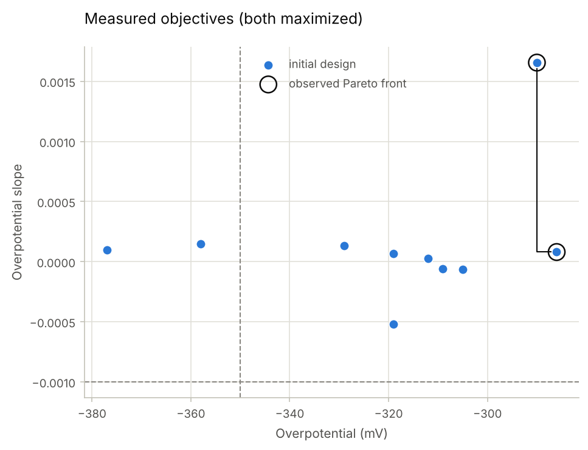
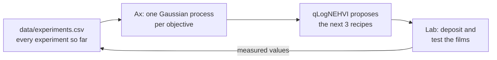
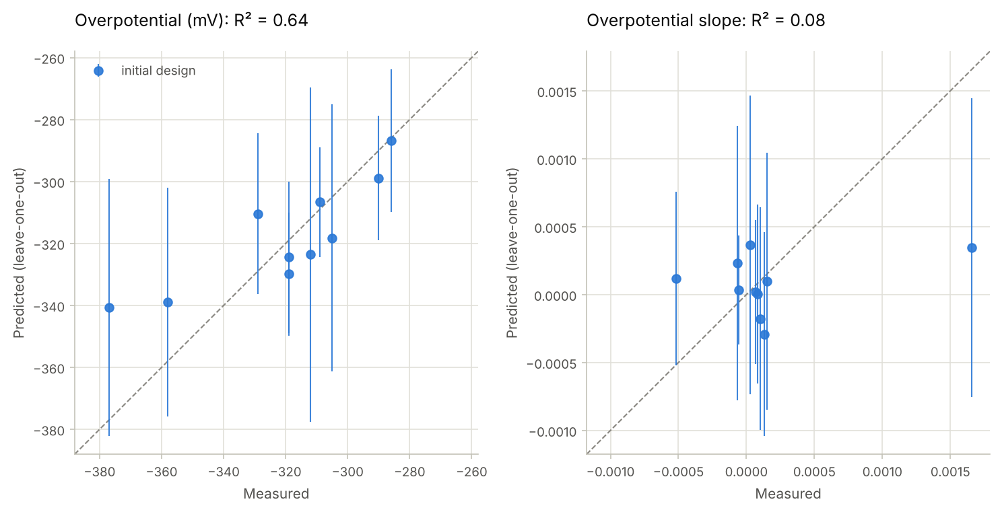
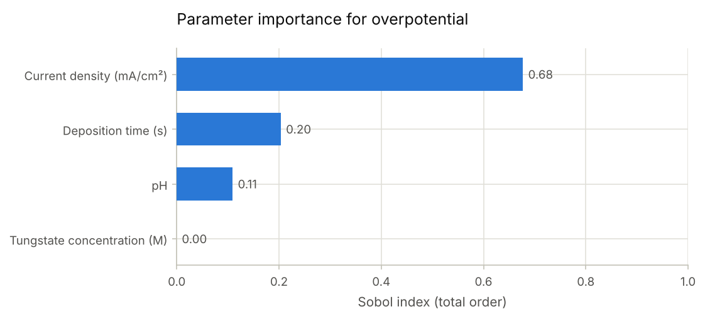
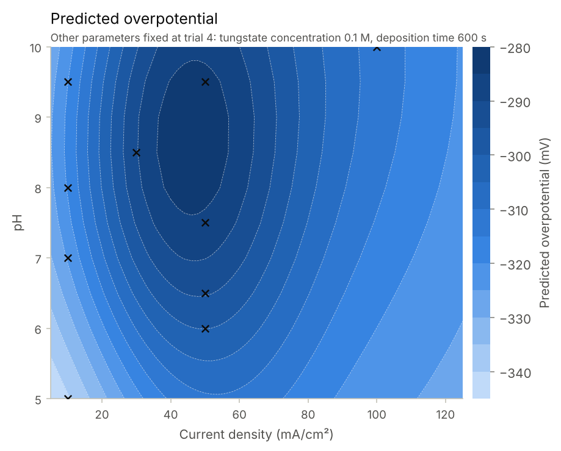
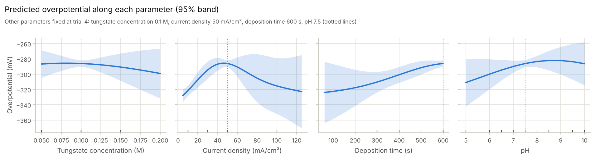

# Ni-W electrodeposition: multi-objective Bayesian optimization with Ax

A human-in-the-loop workflow that proposes which Ni-W electrodeposition recipes to try next, to find cathodes for the hydrogen evolution reaction (HER) that are both active and stable. Each round, [Ax](https://ax.dev) proposes a batch of three recipes; they are run in the lab, the results go into a CSV, and the loop repeats.

This is a personal project that continues my MSc thesis at DTU Energy (2023) on Bayesian-optimized electrodeposition of Ni-W catalysts for hydrogen evolution. After the thesis ended, I rebuilt its optimization workflow on my own with Ax and have kept developing it here; it is not part of the thesis itself.

**About the data.** `data/experiments.csv` holds 10 lab measurements (the initial design) and two batches that Ax suggested afterwards. Those six were completed with illustrative values, not measurements, to demonstrate the loop, and the `source` column marks them. Everything under [Results so far](#results-so-far) uses the 10 lab measurements only.



## The problem

Every experiment means preparing a bath, depositing a film, and running electrochemical tests, so a campaign has room for tens of experiments, not hundreds. The goal is two competing properties:

| Objective | Direction | Threshold |
|---|---|---|
| `overpotential`: HER overpotential (mV, negative) | maximize, i.e. closer to zero | −350 |
| `overpotential_slope`: drift of the overpotential over cycling | maximize; ≥ 0 means no degradation | −0.001 |

Because the two compete, there is no single best recipe. The aim is the Pareto front: the set of recipes where neither objective can improve without the other getting worse. The search space has four process parameters:

| Parameter | Range | Type |
|---|---|---|
| `tungstate_concentration` | 0.05–0.20 M | continuous |
| `current_density` | 5–125 mA/cm² | integer |
| `deposition_time` | 60–600 s | integer |
| `pH` | 5–10 | steps of 0.5 |

Temperature is held at 25 °C.

## How it works



1. The notebook rebuilds the Ax experiment from the CSV every session, so the readable table is the record of the campaign rather than an Ax snapshot file, whose format changes between Ax versions.
2. Ax fits one Gaussian process per objective and picks the batch with qLogNEHVI (noisy expected hypervolume improvement, log-space version), which favours recipes likely to extend the Pareto front beyond the thresholds.
3. The batch is appended to the CSV with empty objective cells. Until they are filled in, Ax treats those recipes as pending and does not propose them again.

## Results so far

The evidence is 10 lab measurements in a four-dimensional search space, so the model's conclusions are tentative. None of the Ax-suggested recipes has been measured yet, so there is no evidence yet that the optimization improves on the hand-picked initial design.

**Measured Pareto front.** Two of the 10 recipes are non-dominated (figure above): trial 4 has the best overpotential (−286 mV; 0.10 M tungstate, 50 mA/cm², 600 s, pH 7.5) and trial 7 the best slope (+0.0017; 30 mA/cm², pH 8.5, otherwise the same). Eight of the 10 meet both thresholds.

**How well the model predicts.** In leave-one-out cross-validation, each recipe is predicted by a model fitted to the other nine, shown with its 95% predictive interval. The overpotential model reaches R² = 0.64. The slope model reaches R² = 0.08: it has found no usable pattern yet, so the next suggestions are driven mainly by the overpotential.



**What the overpotential model has learned.** Current density accounts for most of the predicted variation, followed by deposition time and pH; tungstate concentration has almost no effect within its range. The predicted best region is around 40–55 mA/cm² and pH 8–9.5, with longer deposition times better up to the 600 s limit.

<p>
  
  
</p>



The contour and slices hold the other parameters at trial 4. Ax computes all of these numbers; `src/niw_bo/plotting.py` draws them with matplotlib, and `python scripts/make_figures.py` regenerates them from the lab rows of the CSV.

**Next batch.** From the 10 lab measurements, Ax proposes:

| tungstate (M) | current density (mA/cm²) | deposition time (s) | pH |
|---|---|---|---|
| 0.050 | 34 | 600 | 9.0 |
| 0.069 | 46 | 600 | 9.5 |
| 0.142 | 34 | 596 | 8.0 |

Given the same data, BayBE proposes recipes in the same region: 35–50 mA/cm², pH 8–9, deposition time at 600 s ([`extras/baybe_comparison.ipynb`](extras/baybe_comparison.ipynb)). Every proposal sits at the upper end of the deposition-time range, which suggests extending that range if the process allows.

## Quick start

Requires Python ≥ 3.11. Tested with Python 3.12 and 3.13, `ax-platform` 1.3.1.

```bash
git clone https://github.com/michailmitsakis/Ax_bayes_opt_NiW.git
cd Ax_bayes_opt_NiW
python -m venv .venv
source .venv/bin/activate          # Windows: .venv\Scripts\activate
pip install -e ".[notebook,dev]"
jupyter lab niw_optimization.ipynb
```

Running the notebook with the default `SEED = 0` should reproduce the batch in the table above; a different Ax, PyTorch or Python version can change the last digits.

`python -m pytest` runs the tests. They check that the data stays inside the search space, that pH keeps its half steps and integer parameters refuse fractions, that unmeasured rows stay pending and that illustrative rows can be excluded; the two slow tests check that Ax produces a valid batch and that every figure draws. The slow tests take up to a minute together; `pytest -m "not slow"` skips them.

Optional:
- `pip install -e ".[baybe]"` for the BayBE comparison notebook.
- The notebook can also show Ax's own interactive analysis cards (`SHOW_AX_CARDS = True`). One of them needs the [Graphviz](https://graphviz.org/download/) program on the PATH (on Windows, `winget install Graphviz.Graphviz`); everything else runs without it.

## Running a new round

1. In the notebook, set `APPEND_TO_CSV = True` and run all cells. The next batch is appended to `data/experiments.csv` with empty objective cells and `source = lab`.
2. Run the experiments. In the CSV, change the suggested parameters to the values actually used, and enter the measured objectives.
3. Run the notebook again, then `python scripts/make_figures.py` to refresh the README figures.

The illustrative rows can be deleted once real measurements take their place. To see the loop with all 16 rows, set `INCLUDE_ILLUSTRATIVE = True` in the notebook; the illustrative points are drawn hollow.

To start a campaign from scratch, use a CSV with only the header row and call `build_client(initialization_budget=None)`; Ax then begins with the center of the search space and quasi-random (Sobol) points. To adapt the workflow to another process, edit `src/niw_bo/config.py` (parameters, objectives, thresholds, batch size, axis labels) and use matching column names in the CSV.

## Repository layout

```
niw_optimization.ipynb             one optimization round (start here)
data/experiments.csv               every experiment: batch, parameters, objectives, source
src/niw_bo/config.py               search space, objectives, thresholds, batch size, labels
src/niw_bo/campaign.py             CSV <-> Ax Client: load, attach experiments, suggest a batch
src/niw_bo/plotting.py             matplotlib figures drawn from Ax's analyses and predictions
scripts/make_figures.py            regenerates the figures in docs/img
extras/baybe_comparison.ipynb      the same problem in BayBE 0.15, compared with Ax
tests/                             pytest suite
docs/notes.md                      method notes: thresholds, noise, batching, reading the analyses
```

## Limitations

- No Ax-suggested recipe has been measured yet; the six rows after the initial design hold illustrative values.
- Each recipe was measured once, so measurement noise is inferred by the model rather than measured. Replicates could be passed to Ax as `(mean, sem)`.
- The slope model has no predictive power yet (R² = 0.08), so in practice the optimization targets the overpotential.
- The figures rely on the data tables behind Ax's analyses, which Ax does not guarantee to keep stable between minor versions; `ax-platform` is therefore pinned to 1.3.x.
- The BayBE comparison treats all parameters as continuous and rounds its recommendations to the lab grid. That is faster than BayBE's hybrid mode with a discrete pH, but not identical to it.

## References

If you use this workflow, please cite Ax and BoTorch:

```bibtex
@InProceedings{pmlr-v293-olson25a,
  title     = {Ax: A Platform for Adaptive Experimentation},
  author    = {Olson, Miles and Santorella, Elizabeth and Tiao, Louis C. and Cakmak, Sait and Garrard, Mia and Daulton, Samuel and Lin, Zhiyuan Jerry and Ament, Sebastian and Beckerman, Bernard and Onofrey, Eric and Igusti, Paschal and Lara, Cristian and Letham, Benjamin and Cardoso, Cesar and Shen, Shiyun Sunny and Lin, Andy Chenyuan and Grange, Matthew and Kashtelyan, Elena and Eriksson, David and Balandat, Maximilian and Bakshy, Eytan},
  booktitle = {Proceedings of the Fourth International Conference on Automated Machine Learning},
  pages     = {21/1--25},
  year      = {2025},
  volume    = {293},
  publisher = {PMLR},
  url       = {https://proceedings.mlr.press/v293/olson25a.html}
}

@inproceedings{balandat2020botorch,
  title     = {{BoTorch: A Framework for Efficient Monte-Carlo Bayesian Optimization}},
  author    = {Balandat, Maximilian and Karrer, Brian and Jiang, Daniel R. and Daulton, Samuel and Letham, Benjamin and Wilson, Andrew Gordon and Bakshy, Eytan},
  booktitle = {Advances in Neural Information Processing Systems 33},
  year      = {2020},
  url       = {https://arxiv.org/abs/1910.06403}
}
```

BayBE documentation: <https://emdgroup.github.io/baybe/stable/>

## License

MIT, see [LICENSE.md](LICENSE.md).
